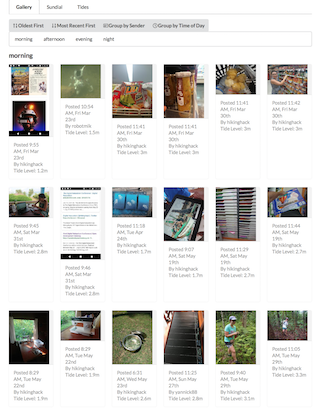

# Matrix Photo Gallery

A photo gallery for photos from a Matrix room.

This project is being developed as a platform for photo visualization
experiments at [Dinacon 2018](https://www.dinacon.org).



## Develop

### Setup

Install Pipenv. Run `pipenv install`.

Set these environment variables: `MATRIX_USER`, `MATRIX_PASSWORD`,
`MATRIX_ROOM_IDS`.

`MATRIX_ROOM_IDS` should be a comma-separated list of Matrix room IDs (or a
single id). Run `pipenv run list_rooms.py` to list the room ids.

Set `MONGODB_URI` to a MongoDB connection URL, *or* install a local MongoDB
instance.

`pipenv run import-events` imports images from Matrix events.

Optional: `pipenv run make-small-thumbnails` creates smaller thumbnails, and uploads
them to the S3 bucket named `BUCKET_NAME`.

### Run

Run the back end (server):

```shell
$ pipenv run server
```

or:

```shell
env FLASK_APP=back:app FLASK_ENV=development flask run
```

Run the front end (client):

```shell
$ pipenv run client
```

or:

```shell
$ cd front
$ yarn install
$ yarn start
```

If `SERVE_LOCAL_IMAGES` is set *and* `pipenv run make-small-thumbnails` has been
run, the server will direct the client to use small thumbnail images from the
local filesystem. This is intended for use in local development.

## License

MIT
